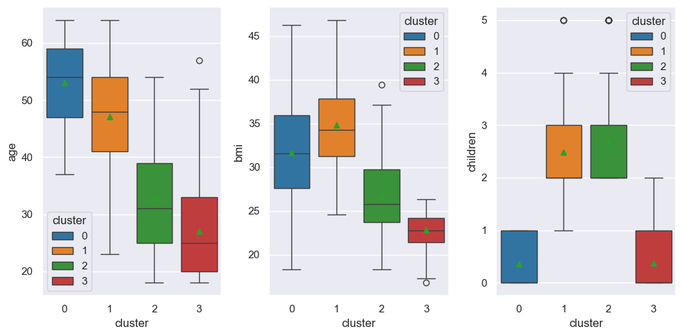
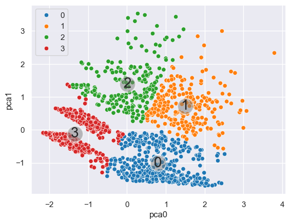
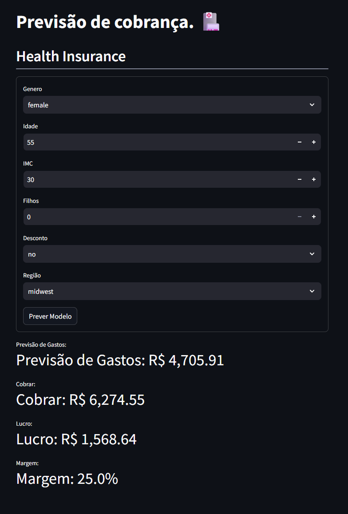

## Análise de Gastos e Precificação – Health Insurance

Projeto de Ciência de Dados desenvolvido como trabalho de Pós-Graduação com foco em:

- Análise exploratória de dados (EDA)

- Segmentação de clientes (Clustering)

- Modelagem preditiva de gastos médicos (Regressão)

- Deploy de aplicação interativa com Streamlit


## Objetivo do Projeto

A seguradora HealthSecure deseja:

    - Identificar perfis de clientes de menor risco
    - Avaliar se clientes com desconto realmente possuem menor custo
    - Criar um modelo preditivo para precificação inteligente
    - Definir margens estratégicas por perfil de cliente

O projeto combina análise estatística, machine learning e aplicação prática de negócio para responder essas perguntas.


## Etapas do Projeto

### Análise Exploratória (EDA)
Arquivo:
[EDA](notebooks/01-jn-EDA.ipynb)

    - Principais análises:
    - Relação entre idade, IMC e gastos médicos
    - Impacto de filhos nos custos
    - Diferenças regionais
    - Avaliação do impacto do desconto nos gastos
    - Identificação de padrões de risco



### Insight importante:
Clientes com maior IMC e maior idade apresentam tendência significativa de aumento nos custos médicos.

## Segmentação de Clientes (Clustering)

Arquivo: [Clustering](notebooks/02-jn-Clustering.ipynb)

Foi aplicado modelo de clusterização para identificar grupos com perfis semelhantes.

Objetivos:

    - Criar segmentação baseada em risco
    - Apoiar estratégia de marketing
    - Definir margens diferentes por perfil

Resultado:
Foram identificados 4 clusters distintos, permitindo:

    - Estratégia de margem personalizada
    - Melhor controle de risco
    - Política de desconto mais direcionada



## Modelo de Regressão (Previsão de Gastos)

Arquivo: [Modelo](notebooks/03-jn-Regressão.ipynb)

Foi desenvolvido um modelo supervisionado para prever:

### Gastos médicos esperados por cliente

Variáveis utilizadas:

    - Gênero
    - Idade
    - IMC
    - Filhos
    - Região
    - Elegibilidade para desconto
    -Cluster

O modelo final foi serializado e utilizado na aplicação.

---

## Aplicação Web com Streamlit

Arquivo principal: [home](home.py)

Foi desenvolvida uma aplicação interativa utilizando Streamlit que permite:

- Inserir dados do cliente
- Classificar automaticamente o cluster
- Aplicar margem estratégica por perfil
- Prever gastos médicos
- Calcular valor ideal a ser cobrado
- Exibir lucro estimado



### Fluxo da aplicação

    - Usuário insere os dados
    - Modelo de cluster identifica o perfil
    - Modelo de regressão estima o custo esperado
    - Sistema aplica margem estratégica
    - Exibe:
        Previsão de Gastos
            Valor a Cobrar
            Lucro
            Margem aplicada

Isso simula uma estratégia real de precificação orientada a dados.


🧠 Principais Aprendizados

    - Aplicação prática de segmentação de clientes
    - Integração entre clustering e regressão
    - Tradução de modelo estatístico para regra de negócio
    - Deploy de modelo com Streamlit
    - Estrutura profissional de projeto de Data Science

```
📂 Estrutura do Projeto
├── dados
├── modelos
├── notebooks
│   ├── 01-jn-EDA.ipynb
│   ├── 02-jn-Clustering.ipynb
│   └── 03-jn-Regressão.ipynb
├── notebooks/src
│   ├── config.py
│   └── graficos.py
├── relatorios
├── home.py
└── README.md

```

## Conclusão Estratégica

Este projeto demonstra como dados podem ser utilizados para:

    - Reduzir risco atuarial
    - Aumentar lucratividade
    - Melhorar políticas de desconto
    - Segmentar clientes de forma inteligente

Mais do que um modelo preditivo, o projeto entrega uma solução de negócio aplicada.

---

👨‍💻 Autor

José Nivaldo.

<p align="center"> 
  <a href="https://www.linkedin.com/in/jnjunior96" target="_blank"></a> 
</p>


